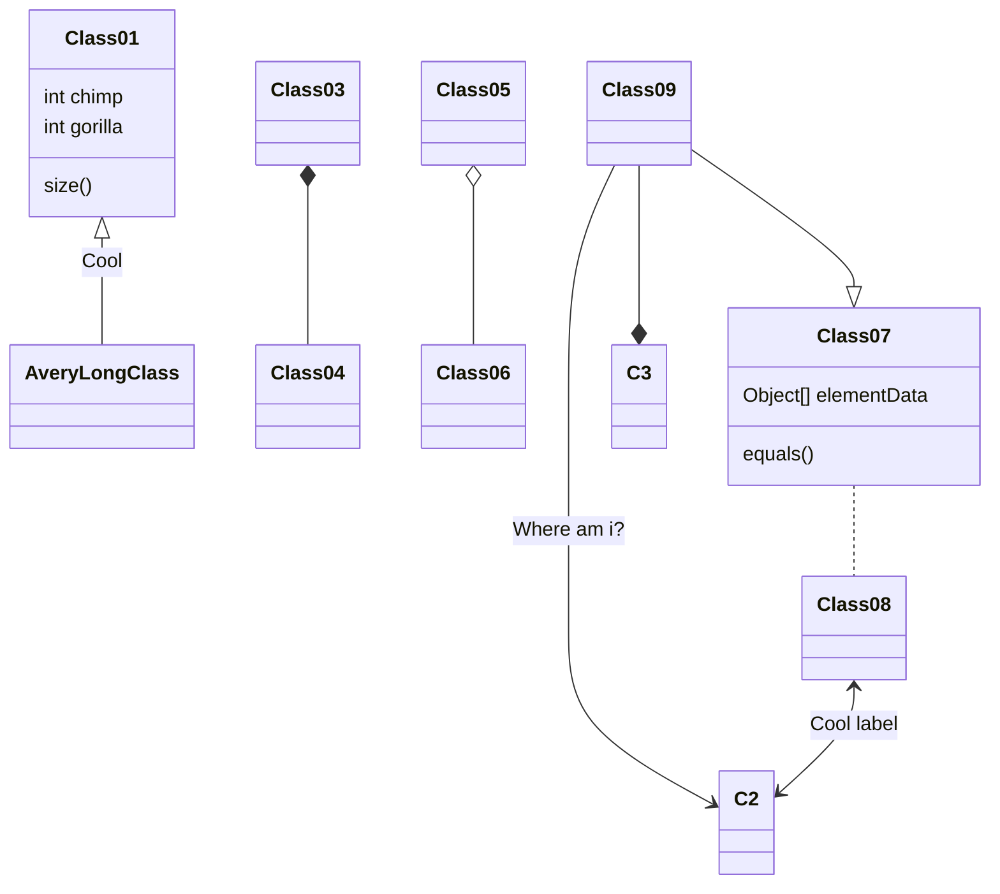

## 基础语法

在线编辑器[markdown.com.cn/editor/](https://markdown.com.cn/editor/ "编辑器")

 <!--more-->

```
## 很标题的标题

正文、**粗体**和*斜体*

- 还有无序列表

分割线↓

---
[链接名](https://markdown.com.cn/cheat-sheet.html "悬停文字")

~~删除线~~

一个表格

| Syntax      | ↓这个可以让一行变长 |
| ----------- | --------------- |
| Header      |看|
| Paragraph   |不用打那麽多空格了|

- [x] 完事了的列表
- [ ] 没完事的列表

> 鲁迅曾经说过：这是句引用

```

效果：

## 很标题的标题

正文、**粗体**和*斜体*

- 还有无序列表

分割线↓

---
[链接名](https://markdown.com.cn/cheat-sheet.html "悬停文字")

~~删除线~~

一个表格

| Syntax      | ↓这个可以让一行变长 |
| ----------- | --------------- |
| Header      |看|
| Paragraph   |不用打那麽多空格了|

- [x] 完事了的列表
- [ ] 没完事的列表

> 鲁迅曾经说过：这是句引用

# 一级标题

文字效果
Chiito and Yuuri are ignorant.
I don't mean that they're somehow stupid or slow—in fact they seem quite smart. I mean they fundamentally lack knowledge and information about the world around them. Part of the fascination of Girls' Last Tour is relieving us of our own ignorance about their world, but I believe an even larger part—and truly what the show is all about—is witnessing their transition from ignorance to knowledge.

## 二级标题

Because while we can make inferences based on our experiences, upbringing, and context—Chii-chan and Yuu don't have that luxury. In philosophy, John Locke came up with the idea of the tabula rasa; wherein he posits that the human mind is a blank slate from which experience imprints knowledge. Girls' Last Tour exhibits this philosophy from its core, and in my opinion it's a major tenet of where my enjoyment of the show comes from. By having Chito and Yuu be ignorant, mangaka tk mizu is able to simultaneously develop them as characters, as well as comment on the nebulous nature of humanity. At its heart, Girls' Last Tour is about nature versus nurture. Chito and Yuu's backstories are made obscure, but as the show goes on we begin to realize that they must've been very sheltered.Most proponents of John Locke's philosophy favor the side of nurture being the main decider to our personalities and behavior, and I think Girls' Last Tour supports this wholeheartedly. As Chito and Yuu go about their "last tour," they run into situations from which they're forced to define part of themselves, their relationship to one another, and different complex issues in the process.One of these is the altruism, empathy, and the value of life. In episode 2, the pair come across a fish off-hand, and are enlightened to the delicious taste of grilled seafood.And although this scene is endearing and adorable, it's also setup for a huge emotional payoff all the way in episode 9. It's here they find the last living fish that they know of, and Yuu is forced to provide an answer to the question "what is the value of life, no matter how minor?"

### 三级标题

This is a question that is still debated hotly today in the context of animal testing in pharmaceuticals. The fact that Chito and Yuu haven't met another living being other than humans up to this point is extremely important, because they don't have the heuristic in their heads about what life means or is. Yuu's first knee-jerk reaction is to immediately want to eat the fish, because all she knows is that fish equal tasty. But as the robot attendant teaches the two about evolution, and the more Yuuri interacts with it, the more she is able to solidify her thoughts on the matter. We are witnessing her write on her "blank slate." When the crisis occurs and she is faced with the fact that the fish might die, flashes of their journey assert themselves in her head. Because, in a sense, this fish is her. It has its own journey—its own struggle for existence. This is the basis of what comprises human empathy, the ability to relate to another living creature's struggles. And it is only after their chance encounter that Chito and Yuu really think about life, and decide to put their own in danger to preserve it. Interestingly enough, this episode also brings up the tenuous definition of life. It's a question we'll have to ask as artificial intelligence becomes more and more advanced, and Girls' Last Tour comments a bit on the potential of programming. A big moment is when Chito actually feels shame being naked in the presence of an inanimate object, when she doesn't exhibit the same inhibitions around just Yuu. Because for all intents and purposes, the machines they find themselves in the company of… are alive—with their own worries and goals they want to accomplish.

#### 四级标题

You can see examples of experiences making their impact this way continually throughout Girls' Last Tour, and how they shape our protagonists outlooks. They encounter the temple and discuss the value of religion, and how it might provide
a moment of reprieve. The encounter with Ishii contrasts with their earlier meeting with Kanazawa, and the two are forced to deal with futility, and the blissfulness of despair, with the caveat of having tried. The encounter with Kanazawa forces them to think about the meaning of life, and what it means to live without purpose.And they're able to imprint upon Kanazawa that there are things in this life worth living for. Or as Yuuri says, "You don't need a reason. There are nice things sometimes. I mean, just look how pretty the view is."

##### 五级标题

Thanks for watching, and be sure to like and subscribe for more content.
And of course, if anything I said was wrong, I'm sorry.
I must've stuttered.

###### 六级标题

A common complaint about Girls' Last Tour is that Chito and Yuuri don't have a lot of depth to their character. But, for me, that's what elevates the series to new heights. The fact that they're essentially blank works as a science/philosophy experiment that would never past a human ethics board. What happens when humans approach difficult subjects with no prior background or context? The result, I'd say—is magical.

**▶黑体字**
This is a question that is still debated hotly today in the context of animal testing in pharmaceuticals.This is a question that is still debated hotly today in the context of animal testing in pharmaceuticals.This is a question that is still debated hotly today in the context of animal testing in pharmaceuticals.

### mermaid 测试区


gantt
dateFormat  YYYY-MM-DD
title Adding GANTT diagram to mermaid

section A section
Completed task            :done,    des1, 2014-01-06,2014-01-08
Active task               :active,  des2, 2014-01-09, 3d
Future task               :         des3, after des2, 5d
Future task2               :         des4, after des3, 5d



